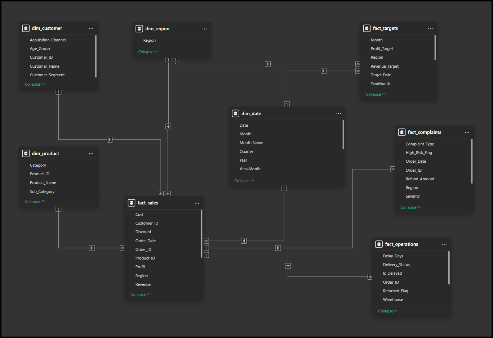

# 📊 Enterprise Business Performance and Risk Analytics

## 🧩 Project Summary
This project presents an **end-to-end business performance and risk analytics solution** built using **Power BI**.  
It integrates sales, targets, operations, and customer complaints data to provide leadership with a **single, unified view of business health**.

The focus of this project is **data analysis, modeling, and decision-making**, not just visualization.

---

## ❓ Business Problem
Organizations often track **sales performance, operational efficiency, and customer complaints in isolation**.  
This makes it difficult for decision-makers to:

- Understand why revenue targets are missed  
- Identify operational bottlenecks impacting customers  
- Detect early warning signs of business risk  
- Connect complaints back to operations and sales performance  

This project addresses that gap by **integrating multiple business functions into one analytical model**.

---

## 🎯 Project Objectives
- Analyze **revenue and profit performance** against targets  
- Identify **top-performing and underperforming regions, products, and customers**  
- Evaluate **operational delays and their impact on business performance**  
- Monitor **customer complaints and risk severity**  
- Deliver **business-ready insights** through interactive dashboards  

---

## 🗂️ Data Sources (Original CSV Files)
The following datasets were provided as raw CSV files and imported directly into Power BI:

- **Sales** – Order-level revenue, cost, and profit data  
- **Targets** – Monthly revenue and profit targets  
- **Operations** – Delivery delays and operational performance  
- **Complaints** – Customer complaints, severity, and risk flags  
- **Customers** – Customer information and segmentation  
- **Products** – Product categories and hierarchy  

📌 All additional tables (such as Date dimension and calculated fields) were created **inside Power BI**.

---

## 🔄 Analysis Approach (Power BI Workflow)

The project followed a structured data analysis workflow:

1. **Data Ingestion**
   - Imported multiple CSV files into Power BI  

2. **Data Cleaning & Preparation**
   - Data type validation  
   - Handling null and inconsistent values  
   - Standardizing column names  
   - Creating business flags and derived columns using Power Query  

3. **Data Modeling**
   - Designed a star schema  
   - Separated fact and dimension tables  
   - Created a dedicated Date table for time intelligence  
   - Avoided unnecessary relationships to prevent ambiguity  

4. **DAX Measures & KPIs**
   - Created reusable business measures using DAX  
   - Implemented time intelligence (MoM, YoY, YTD)  
   - Built performance and risk indicators  

5. **Dashboard Design & Storytelling**
   - Designed role-based dashboards  
   - Added navigation to insight-focused pages  
   - Focused on clarity over visual overload  

---

## 🧱 Data Model Overview
The model consists of:

### Fact Tables
- Sales  
- Targets  
- Operations  
- Complaints  

### Dimension Tables
- Date (created in Power BI)  
- Customer  
- Product  
- Region  

This structure enables flexible slicing by **time, region, product, and customer**, while maintaining data accuracy.

---

## 🧮 Key KPIs & Metrics

### Sales & Targets
- Total Revenue  
- Total Profit  
- Revenue Target  
- Revenue Achievement %  
- Revenue Variance  
- Revenue MoM / YoY Growth  

### Operations
- Delayed Orders  
- Delay Rate %  
- Delayed Orders by Category  
- Delay Trend Over Time  

### Risk & Complaints
- Total Complaints  
- Critical Complaints  
- High Risk %  
- Complaints by Severity  
- Complaints by Type  

> **Note:** Measure names and business logic are documented for clarity.  
> Full DAX formulas are intentionally kept inside the Power BI file.

---

## 📈 Dashboard Pages

### 1️⃣ Executive Overview
Provides a high-level snapshot of business performance, including revenue trends, profit, targets, and overall status.

---

### 2️⃣ Sales and Customer Overview
Analyzes revenue distribution across customers, products, and regions to identify key growth drivers.

---

### 3️⃣ Operations Performance
Focuses on delivery delays, warehouse performance, and operational efficiency.

---

### 4️⃣ Risk and Complaints
Tracks customer complaints, severity levels, and high-risk indicators to highlight potential business risks.

---

### 5️⃣ Insights Pages
Each dashboard is supported by a dedicated **Insights page** that translates visuals into:
- Key observations  
- Risk signals  
- Recommended actions

---

## 🔍 Key Insights
- Revenue performance varies significantly across regions despite similar targets  
- Operational delays strongly correlate with higher complaint volumes  
- Certain product categories experience consistently higher risk exposure  
- Improving operational efficiency can directly reduce customer complaints  

---

## 🛠 Tools Used
- Power BI Desktop  
- Power Query  
- DAX  
- CSV datasets  
- GitHub for documentation  

---

## ▶️ How to View the Project
1. Download the `.pbix` file from this repository  
2. Open it using **Power BI Desktop**  
3. Use slicers and navigation buttons to explore insights  

---

## 👤 Author
**Donepudi Naga Sai Dharani**  
Data Analyst | SQL | Power BI | Excel
